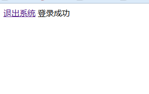
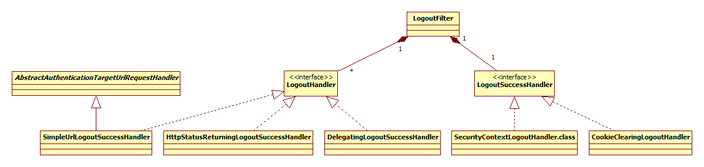

# [Springboot整合SpringSecurity 04-启用登出logout功能][https://blog.csdn.net/qq_34988540/article/details/100785936]

Springboot整合SpringSecurity 04-启用登出logout功能
前面Springboot整合SpringSecurity 02-使用自定义登陆页面我们讲过了SpringSecurity的登陆功能。

本系列的按顺序写的，如果对于某些代码不清楚，请看下前面的几篇文章。
[Springboot整合SpringSecurity 01-使用入门][https://blog.csdn.net/qq_34988540/article/details/100777473]
[Springboot整合SpringSecurity 02-使用自定义登陆页面][https://blog.csdn.net/qq_34988540/article/details/100782695]
[Springboot整合SpringSecurity 03-访问权限控制][https://blog.csdn.net/qq_34988540/article/details/100783250]
Springboot整合SpringSecurity 04-启用登出logout功能
[Springboot整合SpringSecurity 05-使用JDBC实现认证和授权][https://blog.csdn.net/qq_34988540/article/details/100805382]
[Springboot整合SpringSecurity 06-登陆扩展之自定义登陆验证逻辑][https://blog.csdn.net/qq_34988540/article/details/100810297]
[Springboot整合SpringSecurity 07-方法访问权限控制][https://blog.csdn.net/qq_34988540/article/details/100813051]

本章我们继续讲解如何实现登出功能。

## 1.提供一个登出界面

我们在templates目录下面新建一个logout.html

<!DOCTYPE HTML>
<html xmlns="http://www.w3.org/1999/xhtml" xmlns:th="http://www.thymeleaf.org" >
<body>
<form th:action="@{/logout}" method="post">
    <button type="submit" class="btn">Log Out</button>
</form>
</body>
</html>


注意： 这里我们的/logout是使用form表单post提交的。
在SpringSecurity的官方文档里面讲了：

The URL that triggers log out to occur (default is /logout). 

 ==If CSRF protection is enabled (default), then the request must also be a POST==
==当csrf保护是开启的状态的时候，我们的登出请求必须是POST。==

## 2.创建一个跳转到登出页面的接口

```
package com.demo.spring.security.controller;

import org.springframework.stereotype.Controller;
import org.springframework.ui.Model;
import org.springframework.web.bind.annotation.GetMapping;
import org.springframework.web.bind.annotation.RequestParam;
import org.springframework.web.bind.annotation.ResponseBody;

/**

@author flw
*/
   @Controller
   public class HelloController {

   @GetMapping("hello")
public String hello() {
       return "hello";
   }

   @GetMapping("login")
   public String login(@RequestParam(required = false) String error,
                       @RequestParam(required = false) String logout,
                       Model model) {
       if (error != null) {
           model.addAttribute("error", "error");
       }
       if (logout != null) {
           model.addAttribute("logout", "logout");
    }
       return "login";
   }

   @GetMapping("/common/hello")
   @ResponseBody
public String common() {
       return "common";
   }

   @GetMapping("/user/hello")
   @ResponseBody
public String user() {
       return "user";
   }

   @GetMapping("/admin/hello")
   @ResponseBody
public String admin() {
       return "admin";
   }

   @GetMapping("logout")
public String logout() {
    return "logout";
}
}
```

 

## 3.配置WebSecurityConfig

```java
@EnableWebSecurity
public class WebSecurityConfig extends WebSecurityConfigurerAdapter  {

    @Bean
    @Override
    public UserDetailsService userDetailsService() {
        InMemoryUserDetailsManager manager = new InMemoryUserDetailsManager();
        manager.createUser(User.withDefaultPasswordEncoder().username("user")
                .password("user").roles("USER").build());
        manager.createUser(User.withDefaultPasswordEncoder().username("admin")
                .password("admin").roles("ADMIN").build());
        manager.createUser(User.withDefaultPasswordEncoder().username("dba")
                .password("dba").roles("DBA","USER").build());
        return manager;
    }
    
    @Override
    protected void configure(HttpSecurity http) throws Exception {
        http
                .authorizeRequests()
                .antMatchers("/static/**", "/common/**", "/login/**").permitAll()
                .antMatchers("/admin/**").hasRole("ADMIN")
                .antMatchers("/user/**").access("hasRole('USER') and hasRole('DBA')")
                .anyRequest().authenticated()
                .and()
                .formLogin()
                .loginPage("/login")
                .successHandler(new MyAuthenticationSuccessHandler())
                .permitAll()
                .and()
                .logout()

//                .logoutUrl("/my/logout")
//                .logoutSuccessUrl("/my/index")
//                .logoutSuccessHandler(null)
                .invalidateHttpSession(true)
//                .addLogoutHandler(null)
                .deleteCookies("testCookie", "testCookie2");
    }
}
```

logout(): 开启logout功能，在使用WebSecurityConfigurerAdapter的时候默认开启。
logoutUrl("/my/logout")： 指定登出页面的处理地址。默认/logout
logoutSuccessUrl("/my/index"): 指定登出成功跳转页面。默认/login?logout。这里我们使用默认配置
==logoutSuccessHandler(null)： 指定登出成功后的处理handler，指定了这个的话，上面的logoutSuccessUrl()就失效了。==
invalidateHttpSession(true)： 指定是否在登出的时候使session失效，默认为true。
addLogoutHandler(null)： 指定登出的处理handler。
deleteCookies(“testCookie”, “testCookie2”)： 删除指定的cookie。

同时为了测试删除cookie，我在上面登陆的配置里面添加了一个.successHandler(new MyAuthenticationSuccessHandler())。指定了这个的话和登出的成功handler一样，配置的successUrl就失效了。


**MyAuthenticationSuccessHandler配置如下：**

```
/**

@author flw
*/
public class MyAuthenticationSuccessHandler implements AuthenticationSuccessHandler {

private RequestCache requestCache = new HttpSessionRequestCache();
private RedirectStrategy redirectStrategy = new DefaultRedirectStrategy();

public void onAuthenticationSuccess(HttpServletRequest request,
                                    HttpServletResponse response,
                                    Authentication authentication) throws IOException, ServletException {
   // 因为deleteCookies时候指定的path是这样的。所以这里我们的cookie也要加这个path，
    // 否则会删除失败
    String cookiePath = request.getContextPath() + "/";
    Cookie cookie = new Cookie("testCookie", "cookie");
    cookie.setMaxAge(60);
    cookie.setPath(cookiePath);
    Cookie cookie2 = new Cookie("testCookie2", "cookie2");
    cookie2.setMaxAge(60);
    cookie2.setPath(cookiePath);
    response.addCookie(cookie);
    response.addCookie(cookie2);
    SavedRequest savedRequest = requestCache.getRequest(request, response);
    // 当直接进入的登陆页面，跳转到hello.html。
    if (savedRequest == null) {
        redirectStrategy.sendRedirect(request, response, "/hello");
        return;
    }

String targetUrl = savedRequest.getRedirectUrl();
// 当访问其他路径被拦截到登陆页面，跳转到当时的页面。
redirectStrategy.sendRedirect(request, response, targetUrl);

}

}
```

因为使用了自己的SuccessHandler，默认的跳转就失效了，所以上面我们配置了跳转逻辑。具体我们会在后面的章节讲解。

4.开启项目
现在我们可以开始测试项目了。
首先，我们访问前面配置的不需要权限的接口

http://localhost:10022/security/common/hello

结果如下：


可以看到，这时候没有我们的测试testCookie。

然后我们直接访问/login登陆页面进行登陆

http://localhost:10022/security/login

可以因为我们没有从其他页面被拦截到登陆页面，所以登陆成功后跳转到MyAuthenticationSuccessHandler指定的默认/hello页面去了。(==没有被拦截页面所以session中没有缓存上一次页面访问？==)


可以看到请求里面已经携带了我们的测试cookie。

然后我们访问登出页面进行登出

http://localhost:10022/security/logout


然后访问/common/hello,结果如下：

可以看到测试的cookie已经被删掉了。

----


# [spring security起步四：退出登录配置以及logout属性详解][https://blog.csdn.net/yin380697242/article/details/51921593]


用户退出登录实质是使当前登录用户的session失效的操作。一般来说,用户退出后,将会被重定向到站点的非安全保护页,比如登录页面.

用户退出功能实现
增加hader.jsp

```
<%@ page language="java" contentType="text/html; charset=UTF-8" pageEncoding="UTF-8"%>
<%@ taglib prefix="c" uri="http://java.sun.com/jstl/core"%>

<!DOCTYPE html>
<html>
<head>
<meta http-equiv="Content-Type" content="text/html; charset=UTF-8">
<title></title>
</head>
<body>
    <c:url value="/logout" var="logoutUrl"/>
    <a href="${logoutUrl }">退出系统</a>
</body>
</html>
```


引入至index.jsp

```
<body>
    <%@include file="header.jsp" %>
    ...
    ...
```

**配置spring security logout 属性**
spring-security.xml

```xml
....
<http auto-config="true" use-expressions="true">
    <intercept-url pattern="/*" access="hasRole('ROLE_USER')" />
    <form-login login-page="/loginPage" login-processing-url="/login"
        always-use-default-target="true" default-target-url="/welcome"
        authentication-failure-url="/loginPage?error=error" />
    <logout logout-url="/logout" logout-success-url="/loginPage" invalidate-session="true"/>
    <csrf disabled="true" />
</http>
...
```

现在我们启动项目,登录成功后可以看到如下页面



点击退出登录,会返回到登录页面。


**logout 属性详解**

1. logout-url LogoutFilter要读取的url,也就是指定spring security拦截的注销url
2. logout-success-url 用户退出后要被重定向的url
3. invalidate-session 默认为true,用户在退出后Http session失效
4. success-handler-ref 对一个LogoutSuccessHandler的引用,用来自定义退出成功后的操作

==这里需要注意的一点是,spring security 3.x默认的注销拦截url为/j_spring_security_logout,而4.x则默认使用/logout==


**spring security退出功能相关类**

==spring security实现注销功能涉及的三个核心类为LogoutFilter,LogoutHandler,LogoutSuccessHandler==

==LoginFilter是实现注销功能的过滤器,默认拦截/logout或者logout属性logout-url指定的url==

==LogoutHandler接口定义了退出登录操作的方法==

```java
void logout(HttpServletRequest request, HttpServletResponse response,
            Authentication authentication);
```


LogoutSuccessHandler接口定义了注销之后的操作方法

```java
void onLogoutSuccess(HttpServletRequest request, HttpServletResponse response,
            Authentication authentication) throws IOException, ServletException;

```

它们之间的类结构图:




spring security退出功能实现流程
spring security在实现注销功能时,大致流程如下

1. 使得HTTP session失效(如果invalidate-session属性被设置为true);
2. 清除SecurityContex(真正使得用户退出)
3. 将页面重定向至logout-success-url指明的URL。

源码下载地址https://github.com/SmallBadFish/spring_security_demo/archive/0.2.0-logout.zip

------------------------------------------------


# [Spring Security(十)：登出Logout][https://blog.csdn.net/vbirdbest/article/details/90553444]

### 一：Spring Security默认退出处理逻辑

使当前session失效
清楚与当前用户相关的remember-me记录
清空当前的SecurityContext
重定向到登录页

### 二：Spring Security 登出配置

spring security登出配置sping给出了一套默认值，如果不使用默认值，可以配置自己的值

logoutUrl：登出对应的地址
logoutSuccessHandler：登出成功后可以在这里处理自己的登出逻辑
deleteCookies：登出成功后删除指定的Cookie

```
protected void configure(HttpSecurity http) throws Exception {
	http.csrf().disable()
	.antMatchers("/login", "/session/invalid", "/logout", "/signOut").permitAll()
	.logout()
	    .logoutUrl("/logout")
	    .logoutSuccessHandler(myLogoutSuccessHandler)
	    .deleteCookies("JSESSIONID")
	    .permitAll();
}    

```


```java
@Slf4j
@Component
public class MyLogoutSuccessHandler implements LogoutSuccessHandler {
    @Override
    public void onLogoutSuccess(HttpServletRequest request, HttpServletResponse response, Authentication authentication) throws IOException, ServletException {
        log.info("退出成功");

        response.sendRedirect("/signOut");
    }

}
```


### 三：登出页面

路径与视图的简单映射

```java
@Configuration
public class WebMvcConfiguration implements WebMvcConfigurer {

    @Override
    public void addViewControllers(ViewControllerRegistry registry) {
        registry.addViewController("/login").setViewName("login");
        registry.addViewController("/signOut").setViewName("signOut");
        registry.addViewController("/index").setViewName("index");
    }

}
```


signOut.html 登出页面

<!DOCTYPE html>
<html lang="en"
      xmlns="http://www.w3.org/1999/xhtml"
      xmlns:th="http://www.thymeleaf.org">
<head>
    <meta charset="utf-8">
    <title>退出</title>
</head>
<body>
退出成功
</body>
</html>